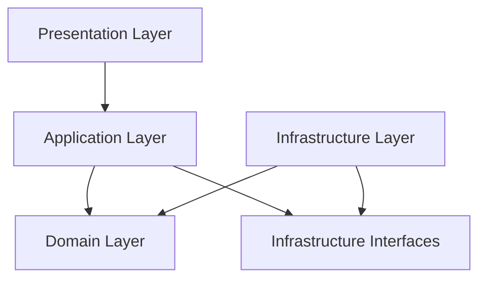

# Design Document

## Overview

The WPF MacroNex is a desktop automation application built using .NET 8 and WPF with a hexagonal architecture approach. The system enables users to record, edit, manage, and execute automation scripts while maintaining strict safety controls and comprehensive logging. The architecture emphasizes separation of concerns, testability, and maintainability through clear layer boundaries and dependency inversion.

The application follows MVVM pattern using CommunityToolkit.Mvvm for data binding and command handling. The core domain logic remains independent of UI and infrastructure concerns, allowing for comprehensive unit testing and future extensibility. Safety mechanisms including global kill switches and execution limits ensure user control and system protection.

## Architecture

### Hexagonal Architecture Layers

The application implements a hexagonal (ports and adapters) architecture with the following layers:

**Domain Layer (Core)**
- Contains business logic and domain entities
- Independent of external frameworks and infrastructure
- Defines interfaces (ports) for external dependencies
- Includes Script, Command, and execution domain models

**Application Layer**
- Orchestrates domain operations and use cases
- Contains application services and command handlers
- Implements business workflows and validation
- Manages cross-cutting concerns like logging and security

**Infrastructure Layer (Adapters)**
- Implements domain interfaces with concrete adapters
- Handles Win32 API interactions (SendInput, SetWindowsHookEx)
- Manages file system operations and JSON serialization
- Provides system-level services like global hotkeys

**Presentation Layer (WPF/MVVM)**
- ViewModels using CommunityToolkit.Mvvm
- Views implemented in WPF with XAML
- Data binding and command routing
- UI-specific validation and formatting

### Dependency Flow



Dependencies flow inward toward the domain, with infrastructure implementing domain-defined interfaces.

## Components and Interfaces

### Core Domain Components

**Script Entity**
```csharp
public class Script
{
    public Guid Id { get; }
    public string Name { get; set; }
    public List<Command> Commands { get; }
    public DateTime CreatedAt { get; }
    public DateTime ModifiedAt { get; set; }
}
```

**Command Hierarchy**
```csharp
public abstract class Command
{
    public Guid Id { get; }
    public TimeSpan Delay { get; set; }
}

public class MouseMoveCommand : Command
{
    public Point Position { get; set; }
}

public class MouseClickCommand : Command
{
    public Point Position { get; set; }
    public MouseButton Button { get; set; }
    public ClickType Type { get; set; } // Down, Up, Click
}

public class KeyboardCommand : Command
{
    public string Text { get; set; }
    public List<VirtualKey> Keys { get; set; }
}

public class SleepCommand : Command
{
    public TimeSpan Duration { get; set; }
}
```

### Application Services

**IScriptManager Interface**
```csharp
public interface IScriptManager
{
    Task<IEnumerable<Script>> GetAllScriptsAsync();
    Task<Script> GetScriptAsync(Guid id);
    Task<Script> CreateScriptAsync(string name);
    Task UpdateScriptAsync(Script script);
    Task DeleteScriptAsync(Guid id);
    Task<Script> DuplicateScriptAsync(Guid id);
}
```

**IRecordingService Interface**
```csharp
public interface IRecordingService
{
    bool IsRecording { get; }
    event EventHandler<CommandRecordedEventArgs> CommandRecorded;
    Task StartRecordingAsync();
    Task StopRecordingAsync();
    Task<List<Command>> GetRecordedCommandsAsync();
}
```

**IExecutionService Interface**
```csharp
public interface IExecutionService
{
    ExecutionState State { get; }
    Script CurrentScript { get; }
    int CurrentCommandIndex { get; }
    event EventHandler<ExecutionProgressEventArgs> ProgressChanged;
    
    Task StartExecutionAsync(Script script, ExecutionOptions options);
    Task PauseExecutionAsync();
    Task ResumeExecutionAsync();
    Task StopExecutionAsync();
    Task StepExecutionAsync();
}
```

### Infrastructure Adapters

**IInputSimulator Interface**
```csharp
public interface IInputSimulator
{
    Task SimulateMouseMoveAsync(Point position);
    Task SimulateMouseClickAsync(Point position, MouseButton button, ClickType type);
    Task SimulateKeyboardInputAsync(string text);
    Task SimulateKeyPressAsync(VirtualKey key, bool isDown);
    Task DelayAsync(TimeSpan duration);
}
```

**IGlobalHotkeyService Interface**
```csharp
public interface IGlobalHotkeyService
{
    event EventHandler<HotkeyPressedEventArgs> HotkeyPressed;
    Task RegisterHotkeyAsync(HotkeyDefinition hotkey);
    Task UnregisterHotkeyAsync(HotkeyDefinition hotkey);
    Task UnregisterAllHotkeysAsync();
}
```

**IFileStorageService Interface**
```csharp
public interface IFileStorageService
{
    Task<IEnumerable<Script>> LoadScriptsAsync();
    Task SaveScriptAsync(Script script);
    Task DeleteScriptAsync(Guid id);
    Task<Script> ImportScriptAsync(string filePath);
    Task ExportScriptAsync(Script script, string filePath);
}
```

### MVVM ViewModels

**MainViewModel**
- Orchestrates overall application state
- Manages script collection and selection
- Handles global commands and hotkeys
- Coordinates between child ViewModels

**ScriptListViewModel**
- Manages script collection display
- Handles script CRUD operations
- Provides search and filtering capabilities
- Supports drag-and-drop operations

**CommandGridViewModel**
- Displays and edits command sequences
- Supports command reordering and modification
- Handles command insertion and deletion
- Provides command validation feedback

**ExecutionControlViewModel**
- Manages execution state and controls
- Handles play, pause, resume, stop operations
- Displays execution progress and status
- Manages execution options and settings

**LoggingViewModel**
- Displays real-time logging information
- Provides log filtering and search capabilities
- Manages log persistence and export
- Shows execution events and errors

## Data Models

### Script Storage Schema

The application uses JSON for script persistence with a versioned schema approach:

```json
{
  "version": "1.0",
  "scripts": [
    {
      "id": "guid",
      "name": "string",
      "createdAt": "datetime",
      "modifiedAt": "datetime",
      "commands": [
        {
          "id": "guid",
          "type": "MouseMove|MouseClick|Keyboard|Sleep",
          "delay": "timespan",
          "parameters": {
            // Type-specific parameters
          }
        }
      ]
    }
  ]
}
```

### Command Serialization

Each command type has specific serialization parameters:

**MouseMoveCommand**
```json
{
  "type": "MouseMove",
  "parameters": {
    "x": 100,
    "y": 200
  }
}
```

**MouseClickCommand**
```json
{
  "type": "MouseClick",
  "parameters": {
    "x": 100,
    "y": 200,
    "button": "Left|Right|Middle",
    "clickType": "Down|Up|Click"
  }
}
```

**KeyboardCommand**
```json
{
  "type": "Keyboard",
  "parameters": {
    "text": "Hello World",
    "keys": ["VK_CONTROL", "VK_C"]
  }
}
```

### Configuration Model

Application settings and preferences are stored separately:

```json
{
  "version": "1.0",
  "settings": {
    "killSwitchHotkey": {
      "modifiers": ["Control", "Shift"],
      "key": "Escape"
    },
    "recordingHotkeys": {
      "startStop": {
        "modifiers": ["Control", "Alt"],
        "key": "R"
      }
    },
    "executionLimits": {
      "maxCommands": 10000,
      "maxExecutionTime": "00:30:00"
    },
    "ui": {
      "theme": "Light|Dark",
      "autoSave": true,
      "showConfirmations": true
    }
  }
}
```

## Correctness Properties

*A property is a characteristic or behavior that should hold true across all valid executions of a system?”essentially, a formal statement about what the system should do. Properties serve as the bridge between human-readable specifications and machine-verifiable correctness guarantees.*

### Property 1: Script Lifecycle Integrity
*For any* script management operation (create, delete, rename, copy), the script collection should maintain consistency with unique identifiers, proper metadata updates, and immediate persistence to storage.
**Validates: Requirements 1.1, 1.2, 1.3, 1.4, 1.5, 1.6**

### Property 2: Command Sequence Preservation
*For any* command manipulation operation (add, delete, reorder, modify), the command sequence should maintain integrity with correct indices, valid parameters, and preserved execution order.
**Validates: Requirements 2.1, 2.2, 2.3, 2.4, 2.5, 2.6**

### Property 3: Recording Accuracy
*For any* sequence of user input events during recording, the captured commands should accurately represent the original actions with correct coordinates, timing, and event filtering.
**Validates: Requirements 3.1, 3.2, 3.3, 3.4, 3.5, 3.6**

### Property 4: Execution State Management
*For any* execution control operation (start, pause, resume, stop, step), the executor should maintain correct state transitions, timing adjustments, and command progression.
**Validates: Requirements 4.1, 4.2, 4.3, 4.4, 4.5, 4.6**

### Property 5: Safety Mechanism Effectiveness
*For any* potentially dangerous operation or execution scenario, the safety controls should activate appropriately with kill switch responsiveness, authorization prompts, and limit enforcement.
**Validates: Requirements 5.1, 5.2, 5.3, 5.4, 5.5, 5.6**

### Property 6: Serialization Round-Trip Consistency
*For any* valid script object, serializing to JSON then deserializing should produce an equivalent script with all commands, metadata, and relationships preserved.
**Validates: Requirements 6.1, 6.2, 6.3, 6.4, 6.5, 6.6**

### Property 7: Logging Completeness
*For any* automation event or user action, the logging system should capture complete information with accurate timestamps, appropriate log levels, and persistent storage.
**Validates: Requirements 7.1, 7.2, 7.3, 7.4, 7.5, 7.6**

### Property 8: UI Responsiveness and Functionality
*For any* user interface interaction, the system should respond immediately with correct visual updates, keyboard shortcut handling, and search/filtering capabilities.
**Validates: Requirements 8.2, 8.3, 8.4, 8.6**

## Error Handling

### Exception Management Strategy

The application implements a comprehensive error handling strategy across all layers:

**Domain Layer Exceptions**
- `InvalidScriptException`: Thrown when script validation fails
- `InvalidCommandException`: Thrown when command parameters are invalid
- `ExecutionLimitExceededException`: Thrown when safety limits are exceeded
- `RecordingException`: Thrown when recording operations fail

**Infrastructure Layer Exceptions**
- `Win32Exception`: Wraps Win32 API errors with context
- `HotkeyRegistrationException`: Thrown when hotkey registration fails
- `InputSimulationException`: Thrown when input simulation fails
- `StorageException`: Thrown when file operations fail

**Application Layer Error Handling**
- Global exception handler captures unhandled exceptions
- User-friendly error messages with recovery suggestions
- Automatic error logging with stack traces and context
- Graceful degradation when non-critical features fail

### Safety Error Responses

**Kill Switch Activation**
- Immediate termination of all automation threads
- Release of all Win32 hooks and resources
- Reset of execution state to safe defaults
- Emergency logging of termination event

**Execution Limit Violations**
- Automatic execution termination
- Clear error messaging to user
- Detailed logging of limit violation
- Prevention of further execution until reset

**Win32 API Failures**
- Fallback to alternative input methods when possible
- Clear error reporting with system context
- Automatic retry with exponential backoff
- Graceful degradation to read-only mode if necessary

## Testing Strategy

### Dual Testing Approach

The application employs both unit testing and property-based testing for comprehensive coverage:

**Unit Tests**
- Specific examples and edge cases for each component
- Integration points between layers
- Error conditions and exception handling
- UI component behavior and data binding
- Win32 API interaction scenarios

**Property-Based Tests**
- Universal properties across all valid inputs
- Comprehensive input coverage through randomization
- Correctness validation for core business logic
- State transition verification
- Data integrity across operations

### Property-Based Testing Configuration

**Framework Selection**: Use FsCheck.NET for property-based testing in C#
- Minimum 100 iterations per property test
- Custom generators for domain objects (Scripts, Commands)
- Shrinking support for minimal failing examples
- Integration with existing unit test framework (xUnit/NUnit)

**Test Tagging Format**
Each property test must include a comment referencing the design document property:
```csharp
[Property]
// Feature: macronex, Property 1: Script Lifecycle Integrity
public Property ScriptLifecycleIntegrity(Script script, ScriptOperation operation)
```

**Property Test Implementation Requirements**
- Each correctness property implemented by a single property-based test
- Custom generators for realistic test data
- Proper setup and teardown for stateful operations
- Mock implementations for infrastructure dependencies
- Comprehensive assertion coverage for property validation

### Testing Layer Strategy

**Domain Layer Testing**
- Pure unit tests without external dependencies
- Property-based tests for business logic validation
- Mock implementations for all external interfaces
- Comprehensive coverage of domain rules and invariants

**Application Layer Testing**
- Integration tests with mocked infrastructure
- Workflow testing for complete use cases
- Error handling and recovery scenario testing
- Cross-cutting concern validation (logging, security)

**Infrastructure Layer Testing**
- Integration tests with real Win32 APIs (where safe)
- Mock-based testing for dangerous operations
- Performance testing for input simulation
- Compatibility testing across Windows versions

**Presentation Layer Testing**
- UI automation tests for critical workflows
- Data binding validation tests
- Command routing and execution tests
- Visual state verification tests

### Test Data Management

**Script Generation**
- Random script generation with valid command sequences
- Edge case scripts (empty, very large, malformed)
- Realistic user workflow simulation
- Performance stress test scenarios

**Command Generation**
- Valid command parameter ranges
- Invalid parameter boundary testing
- Complex command sequence generation
- Timing and coordination validation

**Configuration Testing**
- Valid and invalid configuration combinations
- Hotkey conflict detection and resolution
- Limit boundary testing and validation
- Migration scenario testing for schema changes